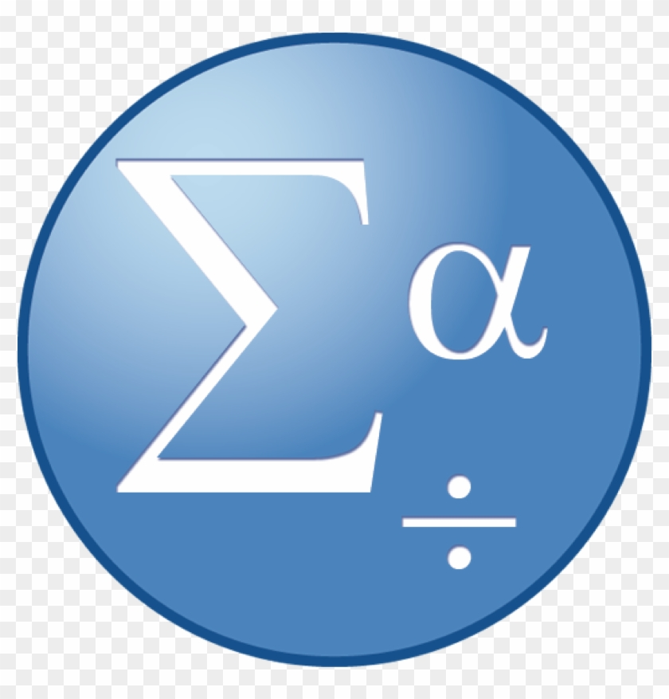

   

# Hi there 👋 Bugra here aka habubey ! 

  

📩 Connect with me:

 

    

### 📑 I'm currently doing front and backend development (Java Script | React | Node.js | Django | Adobe Photoshop & Premier Pro Editor)

- 🏛 With an Economics Master Degree in Sapienza University Rome.
- 👨🏻‍💻 A life-long learner.
- ⚡ Fun fact: I love to play basketball 🏀 , chess ♟and working out 🏋🏻.
- 💬 You can ask me anything you want to know.
- 🚀 I'm developing a projects for my portfolio, i keep improving myself 📃.

###### 🔧 Languages and Tools:

[][JavaScript]
[][ReactJS]
[][git]
[][github]
[][python]
[][HTML]
[][linux]
   

   

   

 

[JavaScript]: https://www.javascript.com/
[ReactJS]: https://tr.reactjs.org/
[vsCode]: https://code.visualstudio.com/
[git]: https://git-scm.com/
[github]: https://github.com/enes9103
[python]: https://www.python.org/
[js]: https://www.javascript.com/
[linux]: https://www.linux.org/
[HTML]: https://www.w3schools.com/html/

   

🖥⌨️ You can reach me:

∙∙∙ 
  

